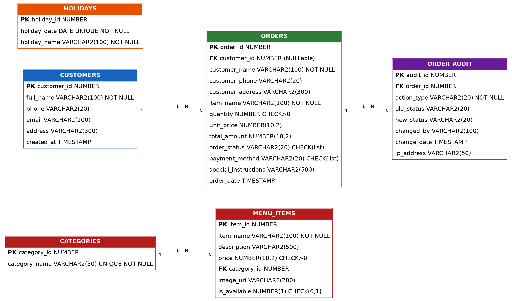

# 🍔 Bite & Grill — Oracle Restaurant Ordering & Management System

**Course:** DPR400210 – Database Programming with Oracle Database
**Institution:** University of Lay Adventists of Kigali (UNILAK), Faculty of Computing and Information Sciences
**Type:** Individual Capstone Project / Final Examination
**Academic Year:** 2025–2026
**Student:** Nadjitiessem GOndje Victoire
**Database naming:** `31603_2025_Nadjitiessem_Restaurant_DB`

---

## 1. Overview

Bite & Grill is a full Oracle 19c database system for a restaurant, built to replace paper-ticket order taking with a normalized schema, a controlled PL/SQL API, trigger-based auditing, an enforced business rule, and a live Python web ordering interface (the innovation component).

Every write to the `orders` table is forced through a single PL/SQL package (`order_management_pkg`) — direct `INSERT`/`UPDATE`/`DELETE` from `PUBLIC` is revoked at the grant level, so the business rule and audit trail apply no matter which client is used.

## 2. Problem Statement

Small restaurants typically take orders by phone or in person and record them on paper — slow, error-prone, with no audit trail and no reliable sales visibility. See [`docs/Bite_and_Grill_Capstone_Report.docx`](./docs/Bite_and_Grill_Capstone_Report.docx) (Phase I) for the full problem definition, target users, objectives, and expected benefits, or [`docs/Bite_and_Grill_Phase1_ProblemStatement.pptx`](./docs/Bite_and_Grill_Phase1_ProblemStatement.pptx) for the required 3-slide submission.

## 3. Repository Structure

```
.
├── README.md
├── sql/
│   ├── 01_create_database.sql          # Tables, sequences, indexes, seed data
│   ├── 02_plsql_packages.sql           # order_management_pkg + first triggers + report procedure
│   └── business_rules_and_security.sql # holidays table, real business-rule trigger, security grants
├── app/
│   └── app.py                          # Python web ordering interface (innovation component)
├── diagrams/
│   ├── ERD_diagram.png
│   └── business_process_swimlane_diagram.png
├── docs/
│   ├── Bite_and_Grill_Capstone_Report.docx
│   ├── Bite_and_Grill_Presentation.pptx
│   └── Bite_and_Grill_Phase1_ProblemStatement.pptx
└── screenshots/
    └── (add your OEM / SQL*Plus / web-app screenshots here before submission)
```

> Rename this repository and the SQL files to match the course naming convention
> (`StudentID_FirstName_Project_DB`) before final submission.

## 4. Database Schema

Six tables, normalized to 3NF (see the report for the one deliberate denormalization on `orders`):

| Table | Purpose |
|---|---|
| `categories` | Menu categories (Burgers, Pizza, Drinks, Desserts, Sides) |
| `menu_items` | Menu items with price, description, availability; FK → categories |
| `customers` | Optional registered-customer records |
| `orders` | Core order records; FK → customers (`ON DELETE SET NULL`) |
| `order_audit` | Full audit trail — every insert and status change |
| `holidays` | Reference table of public holidays, used by the business-rule trigger |



## 5. PL/SQL — `order_management_pkg`

| Unit | Type | Purpose |
|---|---|---|
| `place_order()` | Function | Parameterized insert; computes total, returns new `order_id`, COMMIT/ROLLBACK |
| `update_order_status()` | Procedure | Validates order exists (`NO_DATA_FOUND` → `RAISE_APPLICATION_ERROR(-20001,...)`), updates status |
| `get_order_details()` | Function → `SYS_REFCURSOR` | Full details for one order |
| `get_total_sales()` | Function | `SUM(total_amount)`, excludes `CANCELLED` orders |
| `get_orders_by_status()` | Function → `SYS_REFCURSOR` | Orders filtered by status, most recent first |
| `get_daily_orders_report()` | Procedure + explicit `CURSOR` | Prints today's orders and totals via `DBMS_OUTPUT` |

## 6. Triggers, Business Rule & Security

| Trigger | Fires on | Purpose |
|---|---|---|
| `order_insert_audit` | `AFTER INSERT ON orders` | Logs `ORDER_CREATED` to `order_audit` |
| `order_audit_trigger` | `AFTER UPDATE OF order_status ON orders` | Logs old/new status + who changed it |
| `restrict_weekday_dml` | `BEFORE INSERT OR UPDATE OR DELETE ON orders`, `FOR EACH ROW` | Business rule: blocks writes on weekdays (Mon–Fri) and on dates in `holidays`, raising `ORA-20010` / `ORA-20011` |

**Security:** `REVOKE INSERT, UPDATE, DELETE ON orders FROM PUBLIC` removes direct write access entirely. A dedicated role, `restaurant_app_role`, is granted only `EXECUTE` on `order_management_pkg` and `SELECT` on `orders`. Because the package runs with definer's rights, a session holding only that role can still place and update orders — but exclusively through the package, guaranteeing the business rule and the audit trail apply to every write.

## 7. Business Process

See [`diagrams/business_process_swimlane_diagram.png`](./diagrams/business_process_swimlane_diagram.png) for the full swimlane (Customer → Web App → Package → Trigger check → Staff), and the one-page explanation in the report (Phase II).

## 8. Innovation Component — Web Ordering Interface

`app/app.py` is a Python web app (standard library only — `http.server` + `subprocess`, no framework or ORM) that:
- Renders the live menu from `menu_items` / `categories`
- Places orders via `POST /api/order`, which calls `order_management_pkg.place_order()` — never a raw `INSERT`
- Shows live order status via `GET /api/orders`

Every database interaction is driven through `sqlplus`, so the exact SQL/PL·SQL executed for each request is visible and attributable to the package rather than hidden behind an ORM.

## 9. Setup & Run

**Requirements:** Oracle 19c (or compatible), `sqlplus` on PATH, Python 3.

```bash
# 1. Create schema objects and seed data
sqlplus <user>/<password>@<connect_string> @sql/01_create_database.sql

# 2. Create the package, first-pass triggers, and report procedure
sqlplus <user>/<password>@<connect_string> @sql/02_plsql_packages.sql

# 3. Add the holidays table, the real business-rule trigger, and security grants
sqlplus <user>/<password>@<connect_string> @sql/business_rules_and_security.sql

# 4. Update DB_USER / DB_PASSWORD / DB_SERVICE at the top of app/app.py, then run:
python3 app/app.py
# Open http://localhost:5000
```

> Before final submission, create the dedicated least-privilege user per the naming
> convention and point `app.py` at it instead of the admin account used during development:
> ```sql
> CREATE USER 2210_2025_YourName_Restaurant_DB IDENTIFIED BY "SomeStrongPass1";
> GRANT CONNECT TO 2210_2025_YourName_Restaurant_DB;
> GRANT restaurant_app_role TO 2210_2025_YourName_Restaurant_DB;
> ```

## 10. Demonstration Checklist (Phase VIII)

- [ ] Database structure (tables, constraints, indexes)
- [ ] Sample queries execution
- [ ] PL/SQL package calls (`place_order`, `update_order_status`, reports)
- [ ] Triggers firing live — including a rejected weekday/holiday write
- [ ] Audit trail rows in `order_audit` after an insert and a status change
- [ ] Web app demo (innovation component)
- [ ] Screenshots added to `/screenshots`

## 11. Author

Nadjitiessem Gondje Victoire — DPR400210, Session Day, UNILAK, 2025–2026
